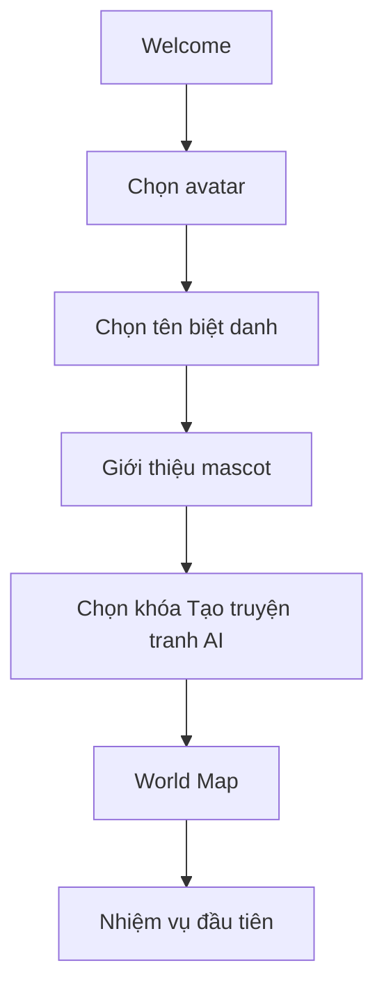
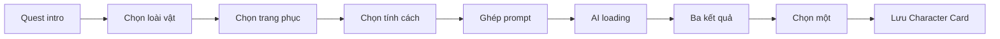
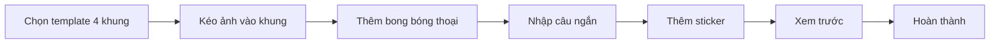
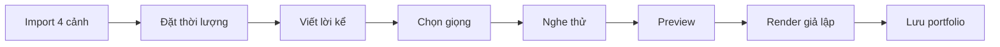
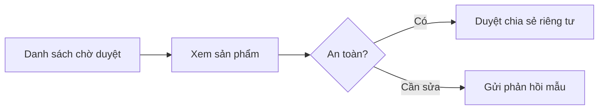
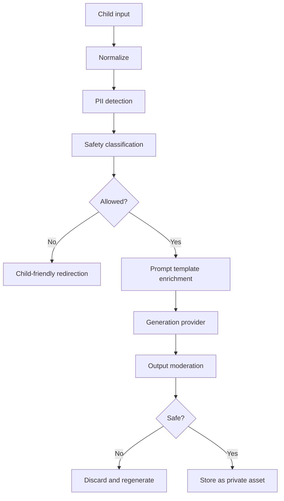
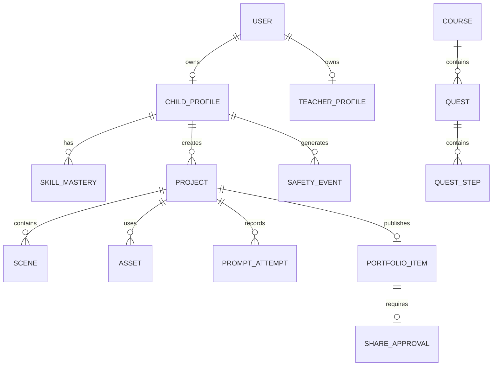

# AI KIDS CREATOR ACADEMY
## Đặc tả sản phẩm và prototype website E-Learning AI dành cho trẻ em

> **Tuyên ngôn sản phẩm:** Trẻ em không vào hệ thống để “xem bài giảng”. Trẻ bước vào một thế giới phiêu lưu, hoàn thành nhiệm vụ sáng tạo và rời mỗi khóa học với một sản phẩm do chính mình xây dựng: nhân vật, truyện tranh, sách nói, storyboard hoặc video ngắn.

---

# 0. Mục đích tài liệu

Tài liệu này là nguồn sự thật chính để:

1. Thiết kế prototype trình bày trước khách hàng.
2. Thống nhất phạm vi giữa Product, UX/UI, Frontend, Backend và AI Engineer.
3. Hướng dẫn AI coding agent tạo một website có thể chạy và demo trọn luồng.
4. Ngăn prototype biến thành LMS truyền thống hoặc chatbot AI mở không phù hợp với trẻ em.
5. Đảm bảo mọi màn hình, nội dung, hình ảnh, tương tác và dữ liệu mẫu đều an toàn cho trẻ.

## 0.1. Đối tượng sử dụng tài liệu

- Product Owner.
- UI/UX Designer.
- Frontend Developer.
- Backend Developer.
- AI/ML Engineer.
- QA Engineer.
- Giáo viên hoặc chuyên gia nội dung.
- AI coding agent như Codex, Claude Code, Cursor Agent hoặc tương đương.

## 0.2. Nguyên tắc ưu tiên khi có xung đột

Thứ tự ưu tiên bắt buộc:

1. **An toàn và lợi ích tốt nhất của trẻ.**
2. **Khả năng hiểu và sử dụng của trẻ 8–11 tuổi.**
3. **Khả năng hoàn thành sản phẩm sáng tạo.**
4. **Khả năng demo ổn định.**
5. Tính thẩm mỹ.
6. Độ phức tạp kỹ thuật.

Không được hy sinh an toàn, khả năng hiểu hoặc độ ổn định chỉ để tạo hiệu ứng “AI hoành tráng”.

---

# 1. Tầm nhìn sản phẩm

## 1.1. Vấn đề

Các nền tảng E-Learning phổ biến thường dựa trên mô hình:

`Video bài giảng → văn bản → trắc nghiệm → điểm số`

Mô hình này có ba hạn chế với trẻ em:

- Trẻ là người tiếp nhận thụ động.
- Phần thưởng tách rời kiến thức.
- Trẻ khó thấy được ý nghĩa của nội dung vừa học.

## 1.2. Giải pháp

Xây dựng một nền tảng **quest-based creative learning**:

`Nhận nhiệm vụ → khám phá kỹ năng → thực hành → thử nghiệm → sửa sản phẩm → mở khóa phần tiếp theo → hoàn thiện dự án cuối khóa`

Kiến thức không được thưởng bằng điểm đơn thuần. Kiến thức được chuyển hóa thành **một bộ phận thật của sản phẩm cuối khóa**.

Ví dụ:

- Học mô tả nhân vật → nhận Character Card.
- Học bối cảnh → tạo Background.
- Học cấu trúc prompt → tạo cảnh truyện.
- Học kiểm tra lỗi AI → chọn và sửa ảnh.
- Học storytelling → ghép comic.
- Học narration → tạo voice.
- Học storyboard → ghép video.

## 1.3. Định vị

**Không phải:** LMS truyền thống, mạng xã hội trẻ em, chatbot mở, công cụ tạo ảnh tự do.

**Là:** Xưởng sáng tạo có hướng dẫn, nơi trẻ học AI, kể chuyện và tư duy phản biện thông qua sản phẩm.

## 1.4. Nhóm người dùng

### Học sinh chính

- Tuổi: 8–11.
- Lớp: 3–5.
- Ngôn ngữ chính: tiếng Việt.
- Thiết bị ưu tiên: tablet, laptop, desktop.
- Kỹ năng đọc: câu ngắn, hướng dẫn trực tiếp.
- Kỹ năng nhập liệu: hạn chế; ưu tiên chọn, kéo-thả, ghép thẻ.
- Mục tiêu: tạo được sản phẩm nhanh, nhìn thấy tiến bộ, cảm thấy mình là “nhà sáng tạo”.

### Phụ huynh

- Theo dõi sản phẩm và kỹ năng.
- Duyệt chia sẻ.
- Quản lý quyền riêng tư.
- Xem báo cáo an toàn.
- Không cần theo dõi trẻ theo kiểu giám sát quá mức.

### Giáo viên

- Giao khóa học và nhiệm vụ.
- Theo dõi kỹ năng.
- Xem và phản hồi sản phẩm.
- Duyệt gallery.
- Tạo nội dung từ template.

---

# 2. Trụ cột thiết kế

## 2.1. Create first

Trẻ phải tạo được thứ gì đó trong 3–5 phút đầu tiên.

Không mở đầu bằng:

- Bài giới thiệu dài.
- Form đăng ký nhiều trường.
- Video bắt buộc trên 5 phút.
- Hướng dẫn dạng slide kéo dài.

## 2.2. One screen, one mission

Mỗi màn hình có một mục tiêu rõ ràng và một nút chính nổi bật.

Ví dụ:

- “Chọn nhân vật”.
- “Kéo nhân vật vào khung”.
- “Tạo ba cảnh”.
- “Nghe thử giọng kể”.
- “Hoàn thành truyện”.

## 2.3. Scaffolded creativity

Trẻ được tự do trong phạm vi an toàn.

Không cung cấp một ô chat trống. Thay bằng:

- Prompt chips.
- Thẻ lựa chọn.
- Mẫu câu.
- Slot bắt buộc.
- Danh sách phong cách đã kiểm duyệt.
- Từ điển hình ảnh và hành động an toàn.

## 2.4. Product as reward

Phần thưởng chính là:

- Nhân vật.
- Cảnh truyện.
- Background.
- Voice.
- Sticker.
- Trang comic.
- Video hoàn chỉnh.

XP và huy hiệu chỉ là lớp phản hồi phụ.

## 2.5. Safe by default

Mọi chức năng phải mặc định riêng tư và giới hạn:

- Không public sản phẩm mặc định.
- Không chat trực tiếp.
- Không bình luận tự do giữa học sinh.
- Không upload ảnh mặt trẻ trong MVP.
- Không clone giọng.
- Không tạo người thật hoặc người nổi tiếng.
- Không prompt tự do không giới hạn.
- Không quảng cáo.
- Không dark pattern.
- Không streak gây sợ mất thành tích.

## 2.6. Explainable AI

Mỗi khi AI tạo kết quả, trẻ phải hiểu:

- AI đã dùng mô tả nào.
- AI có thể sai.
- Trẻ được quyền chọn, sửa hoặc bỏ kết quả.
- Sản phẩm là nội dung có AI hỗ trợ.
- Không nên tin mọi chi tiết AI tạo ra.

---

# 3. Mục tiêu prototype

Prototype phải kể được một câu chuyện sản phẩm hoàn chỉnh trong 5–8 phút demo.

## 3.1. Demo story

> Một học sinh tên “Mây” bước vào Thế giới Sáng tạo, nhận nhiệm vụ tạo một chú mèo phi hành gia, ghép prompt bằng thẻ, tạo ba cảnh an toàn, chọn ảnh tốt nhất, kéo các cảnh vào comic editor, thêm hội thoại, chuyển truyện thành video có giọng kể, nhận huy hiệu và đưa sản phẩm vào Ba lô Sáng tạo. Phụ huynh sau đó duyệt chia sẻ sản phẩm.

## 3.2. Kết quả demo bắt buộc

- Có thể điều hướng qua các route.
- Có dữ liệu mẫu đẹp và nhất quán.
- Kéo-thả hoạt động.
- Có trạng thái loading AI giả lập.
- Có kết quả tạo ảnh giả lập.
- Có comic editor.
- Có storyboard/video editor.
- Có portfolio.
- Có parent approval.
- Có teacher dashboard tối thiểu.
- Có responsive tablet/desktop.
- Không có lỗi console nghiêm trọng.
- Không cần API AI thật để demo.

## 3.3. Ngoài phạm vi MVP

- Text-to-video thật.
- Mạng xã hội công khai.
- Chatbot đa mục đích.
- Marketplace.
- Thanh toán.
- Multiplayer realtime.
- Upload khuôn mặt.
- Voice cloning.
- Feed vô hạn.
- Leaderboard toàn hệ thống.
- Hệ thống tác giả khóa học đầy đủ.

---

# 4. Kiến trúc thông tin

## 4.1. Navigation học sinh

Chỉ dùng tối đa 5 mục:

1. **Thế giới**
2. **Nhiệm vụ**
3. **Xưởng sáng tạo**
4. **Ba lô**
5. **Hồ sơ**

## 4.2. Route đề xuất

```text
/
├── /welcome
├── /onboarding
├── /world
├── /quest/:questId
│   ├── /intro
│   ├── /learn
│   ├── /build
│   ├── /compare
│   └── /complete
├── /studio
│   ├── /prompt
│   ├── /comic
│   ├── /storyboard
│   └── /video
├── /backpack
├── /portfolio/:projectId
├── /profile
├── /parent
│   ├── /overview
│   ├── /approvals
│   ├── /privacy
│   └── /safety
└── /teacher
    ├── /overview
    ├── /students
    ├── /projects
    └── /reviews
```

## 4.3. Điều hướng vai trò

### Học sinh

- Bottom navigation trên tablet.
- Sidebar thu gọn trên desktop.
- Không hiển thị khu vực parent/teacher.

### Phụ huynh

- Dashboard tiêu chuẩn, ít gamification hơn.
- Ngôn ngữ rõ, chuyên nghiệp.
- Tách khỏi giao diện học sinh bằng chế độ người lớn.

### Giáo viên

- Bảng dữ liệu, bộ lọc, card tiến độ.
- Không dùng hình minh họa quá trẻ con.

---

# 5. User flows chính

## 5.1. Flow A — Bắt đầu lần đầu



### Quy tắc

- Không yêu cầu họ tên thật.
- Không yêu cầu ngày sinh chính xác trong UI học sinh.
- Không yêu cầu email trẻ.
- Mỗi bước tối đa 4 lựa chọn chính.
- Có nút nghe hướng dẫn.
- Có thể bỏ qua animation.

## 5.2. Flow B — Tạo nhân vật



## 5.3. Flow C — Tạo comic



## 5.4. Flow D — Chuyển comic thành video



## 5.5. Flow E — Phụ huynh duyệt



---

# 6. Cấu trúc khóa học

## 6.1. Khóa MVP

**Tên:** Tạo truyện tranh AI đầu tiên  
**Độ tuổi:** 8–11  
**Thời lượng:** 60–90 phút, chia thành 8 nhiệm vụ ngắn  
**Sản phẩm cuối:** Truyện tranh 4–6 khung và video kể chuyện 30–45 giây

## 6.2. Danh sách quest

| Quest | Kỹ năng | Sản phẩm |
|---|---|---|
| 1. Gặp Robot Mực Màu | AI là công cụ, không phải con người | Thẻ Creator |
| 2. Tạo nhân vật | Chủ thể, tính cách, ngoại hình | Character Card |
| 3. Xây thế giới | Bối cảnh, thời gian, màu sắc | Background |
| 4. Sự cố bất ngờ | Mở đầu, vấn đề, giải pháp | Story outline |
| 5. Phòng thí nghiệm Prompt | Subject + Action + Place + Mood + Style | Prompt recipe |
| 6. Thám tử AI | Phát hiện chi tiết sai | Detective badge |
| 7. Xưởng truyện tranh | Panel, caption, speech bubble | Comic |
| 8. Rạp phim mini | Storyboard, voice, subtitle | Video |

## 6.3. Cấu trúc mỗi quest

```text
Quest
├── Hook: câu chuyện hoặc animation 20–40 giây
├── Goal: một câu mục tiêu
├── Learn: tối đa 3 thẻ kiến thức
├── Build: hoạt động kéo-thả/chọn/ghép
├── Experiment: thử 2–3 phương án
├── Reflect: một câu hỏi ngắn
├── Reward: asset hoặc kỹ năng
└── Next: gợi ý nhiệm vụ tiếp theo
```

## 6.4. Quy tắc nội dung

- Mỗi đoạn văn tối đa khoảng 25 từ.
- Một câu không quá dài.
- Tránh thuật ngữ trừu tượng.
- Dùng ví dụ trực quan.
- Luôn có voice playback.
- Không dùng giọng đe dọa hoặc làm trẻ xấu hổ.
- Sai thì được thử lại không mất phần thưởng.
- Không giới hạn mạng sống.
- Không hiển thị “Thất bại”.
- Thay bằng “Thử cách khác”.

---

# 7. Gamification

## 7.1. Core loop

```text
Khám phá → Làm nhiệm vụ → Nhận asset → Dùng asset tạo sản phẩm → Nhìn thấy tiến bộ → Mở khóa nhiệm vụ
```

## 7.2. Phần thưởng

### Sản phẩm

- Character Card.
- Background.
- Panel.
- Sticker.
- Voice.
- Transition.
- Cover.

### Năng lực

- Nhà thiết kế nhân vật.
- Người kể chuyện.
- Thám tử AI.
- Người bảo vệ dữ liệu.
- Đạo diễn mini.
- Chuyên gia prompt.

### Tiến độ

- Progress map.
- Mảnh ghép sản phẩm cuối.
- Collection book.
- Không dùng bảng xếp hạng công khai.

## 7.3. XP

XP chỉ dùng để phản hồi:

- Hoàn thành quest: +100.
- Thử phương án mới: +20.
- Phát hiện lỗi AI: +30.
- Sửa prompt: +20.
- Giải thích lựa chọn: +20.

Không trừ XP.

## 7.4. Anti-patterns

Cấm:

- Streak mất sau 24 giờ.
- Loot box.
- Countdown gây áp lực.
- Pay-to-win.
- “Bạn đang thua bạn khác”.
- Leaderboard toàn trường.
- Push notification thao túng.
- Âm thanh dồn dập liên tục.
- Confetti quá mức.

---

# 8. Thiết kế UX/UI cho trẻ em

## 8.1. Layout

### Desktop

```text
┌─────────────────────────────────────────────────────────────┐
│ Logo | Tên nhiệm vụ | Tiến độ | Trợ giúp | Avatar          │
├──────────────┬──────────────────────────────┬───────────────┤
│ Navigation   │ Main workspace               │ Helper panel  │
│ 72–88 px     │ Flexible                     │ 280–320 px    │
├──────────────┴──────────────────────────────┴───────────────┤
│ Context toolbar / timeline                                 │
└─────────────────────────────────────────────────────────────┘
```

### Tablet

- Bottom navigation.
- Helper panel mở dạng drawer.
- Canvas chiếm phần lớn màn hình.
- Toolbar bên dưới hoặc hai bên.
- Không phụ thuộc hover.

### Mobile

Prototype chỉ cần hỗ trợ xem world map, quest, portfolio. Editor phức tạp có thể hiển thị thông báo “Dùng tablet hoặc máy tính để sáng tạo dễ hơn”.

## 8.2. Kích thước tương tác

- Nút chính: cao tối thiểu 48 px.
- Vùng kéo-thả: tối thiểu 56 × 56 px.
- Khoảng cách giữa các target: tối thiểu 8 px.
- Icon có nhãn chữ.
- Focus ring rõ.
- Không dùng icon-only cho hành động quan trọng.

WCAG 2.2 yêu cầu target tối thiểu 24 × 24 CSS px trong nhiều trường hợp; sản phẩm này chủ động dùng 44–48 px trở lên để phù hợp với trẻ.

## 8.3. Typography

Ưu tiên font hỗ trợ tiếng Việt rõ:

- **Primary UI:** Nunito Sans, Be Vietnam Pro hoặc system sans.
- **Display:** Baloo 2 hoặc Fredoka chỉ dùng tiêu đề ngắn.
- **Body size:** 16–18 px.
- **Button:** 16 px, semibold.
- **Heading 1:** 32–40 px.
- **Line height:** 1.4–1.6.
- Không dùng chữ viết tay cho nội dung chính.
- Không viết toàn bộ bằng chữ in hoa.

## 8.4. Màu sắc

Màu phải vui nhưng không gây quá tải.

```css
:root {
  --color-brand-500: #6C5CE7;
  --color-brand-600: #5947D6;
  --color-sky-400: #45C4F9;
  --color-mint-400: #58D8A3;
  --color-sun-400: #FFD166;
  --color-coral-400: #FF7A90;

  --color-bg: #F7F8FC;
  --color-surface: #FFFFFF;
  --color-text: #24304A;
  --color-muted: #667085;
  --color-border: #D9DEEA;

  --color-success: #1F9D6A;
  --color-warning: #B7791F;
  --color-danger: #C24156;
  --color-focus: #1D4ED8;
}
```

### Quy tắc

- Không dùng màu làm tín hiệu duy nhất.
- Text thường đạt contrast WCAG AA.
- Text trên background minh họa phải có lớp nền hoặc shadow đủ rõ.
- Mỗi world có accent riêng nhưng cùng design token.

## 8.5. Bo góc và độ sâu

- Card radius: 20–24 px.
- Button radius: 14–18 px.
- Input radius: 14 px.
- Shadow mềm, không quá dày.
- Không dùng glassmorphism cho nội dung quan trọng.
- Không dùng blur làm giảm khả năng đọc.

## 8.6. Motion

- Transition: 160–240 ms.
- Quest complete: 600–1000 ms.
- Không animation vô hạn ngoài trạng thái chờ.
- Tôn trọng `prefers-reduced-motion`.
- Có nút bỏ qua.
- Không flash.
- Không rung mạnh hoặc zoom bất ngờ.

## 8.7. Tone of voice

- Ấm áp.
- Ngắn.
- Khuyến khích thử nghiệm.
- Không đánh giá con người.

Đúng:

- “Hãy thử thêm một bối cảnh nhé!”
- “Chi tiết nào chưa đúng với ý tưởng của con?”
- “Con có thể chọn lại bất cứ lúc nào.”

Sai:

- “Con làm sai rồi.”
- “Câu trả lời không đạt.”
- “Nhanh lên!”
- “Bạn khác đã hoàn thành trước con.”

---

# 9. Design system

## 9.1. Spacing

```text
4, 8, 12, 16, 20, 24, 32, 40, 48, 64
```

## 9.2. Component bắt buộc

### Foundation

- AppShell.
- TopBar.
- SideNav.
- BottomNav.
- PageContainer.
- Surface.
- Divider.
- VisuallyHidden.

### Navigation

- WorldMapNode.
- QuestPath.
- Breadcrumb đơn giản.
- BackButton.
- AdultModeSwitch.

### Inputs

- BigButton.
- IconLabelButton.
- ChoiceCard.
- PromptChip.
- PromptSlot.
- SafeTextField.
- VoiceInputButton giả lập.
- Slider với label.
- SegmentedControl.
- Toggle.
- DragHandle.

### Feedback

- Toast.
- InlineHint.
- SafetyNotice.
- LoadingCreature.
- ProgressRing.
- QuestProgress.
- EmptyState.
- ErrorState.
- SuccessCelebration.
- UndoSnackbar.

### Creative studio

- AssetTray.
- CanvasStage.
- ComicPanel.
- SpeechBubble.
- StickerItem.
- TransformerControls.
- LayerList.
- Timeline.
- SceneCard.
- VoiceCard.
- PreviewPlayer.

### Adult dashboards

- MetricCard.
- StudentRow.
- SkillHeatmap.
- ApprovalCard.
- ReviewPanel.
- PrivacySettingRow.

## 9.3. Component states

Mọi component tương tác phải có:

- Default.
- Hover nếu có.
- Focus visible.
- Pressed.
- Selected.
- Disabled.
- Loading.
- Error.
- Success.

## 9.4. Drag-and-drop requirements

- Có keyboard alternative.
- Có click-to-select + click-to-place.
- Drop zone đổi trạng thái rõ.
- Asset trở về vị trí cũ nếu drop không hợp lệ.
- Có undo.
- Không xóa bằng kéo ra ngoài.
- Xóa cần nút rõ và có undo.
- Trên touch: long press ngắn hoặc handle rõ, không yêu cầu gesture phức tạp.

---

# 10. Mô tả màn hình chi tiết

# 10.1. Welcome

## Mục tiêu

Cho trẻ hiểu đây là một cuộc phiêu lưu sáng tạo.

## Thành phần

- Logo.
- Mascot.
- Headline: “Biến ý tưởng thành truyện và video!”
- CTA: “Bắt đầu phiêu lưu”.
- Nút người lớn: “Khu vực phụ huynh / giáo viên”.
- Không có form dài.
- Background có minh họa nhưng không chuyển động quá nhiều.

# 10.2. Onboarding

Ba bước:

1. Chọn avatar từ 8 lựa chọn an toàn.
2. Chọn nickname từ gợi ý hoặc nhập tối đa 16 ký tự.
3. Chọn điều muốn tạo: truyện tranh, video, nhân vật.

Có nút nghe hướng dẫn.

# 10.3. World Map

## Thành phần

- Bản đồ dạng đường đi.
- 8 quest nodes.
- Node hiện tại nổi bật.
- Node khóa có mô tả điều kiện.
- Preview sản phẩm cuối.
- Mascot hint.
- Thanh “Bộ truyện của con đã hoàn thành 25%”.

## Trạng thái node

- Locked.
- Available.
- In progress.
- Completed.
- Review suggested.

# 10.4. Quest Intro

- Minh họa chính.
- Tên quest.
- Một câu chuyện hook.
- Ba mục tiêu dạng icon.
- Thời lượng ước tính không gây áp lực: “Khoảng 8 phút”.
- CTA “Bắt đầu”.
- Nút nghe.

# 10.5. Learn Cards

Tối đa 3 card:

- Khái niệm.
- Ví dụ.
- Mẹo an toàn.

Có mini interaction trong mỗi card.

# 10.6. Prompt Builder

## Bố cục

```text
[Asset preview] [Prompt workspace] [AI helper]
```

## Slot

- Nhân vật.
- Hành động.
- Bối cảnh.
- Cảm xúc.
- Phong cách.

## Hành vi

- Kéo chip vào slot.
- Có thể click chip.
- Slot thiếu hiển thị gợi ý.
- Prompt cuối cùng hiện bằng câu tiếng Việt dễ hiểu.
- Nút “Tạo 3 phiên bản”.
- Free text chỉ cho phép câu ngắn và được kiểm tra.

## Safety

- Chặn PII.
- Chặn người thật.
- Chặn bạo lực, tình dục, thù ghét, tự hại.
- Chặn yêu cầu đáng sợ quá mức.
- Hiển thị hướng dẫn tích cực thay vì lỗi kỹ thuật.

# 10.7. AI Generation Loading

- Mascot đang “pha màu”.
- Hiển thị ba bước giả lập:
  1. Đọc ý tưởng.
  2. Vẽ ba phiên bản.
  3. Kiểm tra an toàn.
- Có thời gian 2–4 giây giả lập.
- Không dùng spinner trống.
- Có nút hủy.

# 10.8. Compare Results

- Ba ảnh card.
- Có nhãn “Phiên bản A/B/C”.
- Có nút chọn.
- Có checklist:
  - Đúng nhân vật?
  - Đúng bối cảnh?
  - Có chi tiết lạ?
- Nút “Sửa mô tả”.
- Nút “Dùng ảnh này”.

# 10.9. Comic Studio

## Bố cục

```text
┌────────────────────────────────────────────────────────────┐
│ Back | Tên dự án | Undo | Redo | Preview | Save           │
├──────────────┬────────────────────────────┬────────────────┤
│ Asset tray   │ Comic canvas               │ Properties     │
│ Characters   │ 4-panel template           │ Text           │
│ Backgrounds  │                            │ Style          │
│ Bubbles      │                            │ Layers         │
│ Stickers     │                            │ Accessibility  │
├──────────────┴────────────────────────────┴────────────────┤
│ Page tabs / status                                        │
└────────────────────────────────────────────────────────────┘
```

## Chức năng

- Drag asset.
- Resize.
- Rotate giới hạn.
- Snap vào panel.
- Layer up/down.
- Add speech bubble.
- Add caption.
- Undo/redo.
- Autosave.
- Preview.
- Reset panel.
- Keyboard alternative.

## Giới hạn

- Không upload asset ngoài trong MVP.
- Text bubble tối đa 80 ký tự.
- Font và màu từ danh sách an toàn.
- Không cho kéo asset ra ngoài viewport rồi mất.

# 10.10. Storyboard Studio

- Import panel từ comic.
- Scene list.
- Duration 2–6 giây.
- Transition từ danh sách giới hạn.
- Narration field.
- Voice selection.
- Subtitle mặc định bật.
- Preview.

# 10.11. Video Studio

- Player.
- Timeline đơn giản.
- Track ảnh.
- Track voice.
- Track music an toàn.
- Motion presets: pan, zoom, float.
- Render giả lập.
- Progress rõ.
- Output card.

# 10.12. Backpack

Các tab:

- Nhân vật.
- Bối cảnh.
- Truyện.
- Video.
- Huy hiệu.

Mỗi asset có:

- Thumbnail.
- Tên.
- Quest tạo ra.
- Ngày tạo.
- Nút sử dụng lại.
- Trạng thái riêng tư.

# 10.13. Portfolio

- Cover.
- Title.
- Creator nickname.
- “Có AI hỗ trợ”.
- Comic viewer.
- Video player.
- Skills learned.
- Reflection.
- Share status.
- Parent approval status.

# 10.14. Parent Dashboard

## Overview

- Dự án đang làm.
- Kỹ năng đã luyện.
- Sản phẩm mới.
- Request chờ duyệt.
- Safety events nếu có.
- Privacy status.

## Approvals

- Thumbnail.
- Mục đích chia sẻ.
- Phạm vi:
  - Chỉ gia đình.
  - Lớp học riêng tư.
  - Không chia sẻ.
- Approve.
- Request changes.

## Privacy

- Xóa dữ liệu.
- Download portfolio.
- Cho phép voice.
- Cho phép free text.
- Cho phép gallery lớp.
- Không có targeted ads.

# 10.15. Teacher Dashboard

- Tổng số học sinh.
- Tiến độ khóa.
- Kỹ năng cần hỗ trợ.
- Dự án chờ review.
- Bộ lọc.
- Review bằng sticker và câu mẫu.
- Không xếp hạng học sinh theo điểm công khai.

---

# 11. Learning engine

## 11.1. Skill graph

```text
AI.Foundation
AI.Limitations
Prompt.Subject
Prompt.Action
Prompt.Environment
Prompt.Mood
Prompt.Style
Story.Character
Story.Setting
Story.Conflict
Story.Resolution
Media.Composition
Media.Sequence
Safety.PersonalData
Safety.Copyright
Safety.SyntheticMedia
CriticalThinking.Compare
CriticalThinking.Verify
```

## 11.2. Mastery

Mỗi kỹ năng lưu:

```ts
type SkillMastery = {
  skillId: string;
  level: 0 | 1 | 2 | 3 | 4;
  confidence: number;
  attempts: number;
  successes: number;
  lastPracticedAt: string;
  nextReviewAt: string;
};
```

## 11.3. Adaptive hint

Ví dụ:

- Trẻ bỏ trống bối cảnh hai lần.
- Hệ thống tăng trọng số `Prompt.Environment`.
- Quest sau yêu cầu chọn bối cảnh trước.
- Mascot nhắc: “Nhân vật đang ở đâu nhỉ?”
- Không nói “Con đang yếu phần bối cảnh”.

## 11.4. Spaced repetition

Ôn tập được nhúng vào nhiệm vụ mới:

- Không tạo flashcard rời nếu không cần.
- Dùng kỹ năng cũ trong bối cảnh mới.
- Thời điểm gợi ý:
  - Sau 1 ngày.
  - Sau 3 ngày.
  - Sau 7 ngày.
  - Sau 14 ngày.
- Prototype chỉ cần mô phỏng bằng mock data.

---

# 12. Child safety và content moderation

## 12.1. Hard rules

Cấm hoàn toàn trong prototype:

- Nội dung tình dục.
- Khỏa thân.
- Bạo lực đồ họa.
- Tự hại.
- Chất gây nghiện.
- Vũ khí dùng để gây hại.
- Thù ghét.
- Bắt nạt.
- Người thật và người nổi tiếng.
- Deepfake.
- Khuôn mặt trẻ.
- Địa chỉ, số điện thoại, email, trường học.
- Định vị.
- Chat riêng.
- Link ngoài do học sinh nhập.
- Quảng cáo.
- Mua vật phẩm.

## 12.2. Input pipeline



## 12.3. Child-friendly redirection

Không hiển thị mã lỗi.

Ví dụ:

> “Mình không dùng tên trường hoặc số điện thoại trong câu chuyện nhé. Con có thể chọn một ngôi trường tưởng tượng!”

## 12.4. Output moderation

- NSFW classifier.
- Violence classifier.
- OCR text check.
- Face/person detection nếu cần.
- Watermark hoặc metadata AI-generated.
- Audit log.
- Retry tối đa.
- Nếu không an toàn: dùng asset fallback đã duyệt.

## 12.5. Privacy

- Nickname thay tên thật.
- High privacy mặc định.
- Asset private mặc định.
- Consent record.
- Data minimization.
- Không dùng dữ liệu trẻ để train model.
- Có retention policy.
- Có xóa tài khoản và export.
- Production phải được tư vấn pháp lý tại thị trường triển khai.

---

# 13. Accessibility

Mục tiêu: WCAG 2.2 AA cho toàn bộ flow chính.

## 13.1. Checklist

- Semantic HTML.
- Keyboard navigation.
- Skip link.
- Focus visible.
- Focus không bị che.
- Form label rõ.
- Error gắn với input.
- Không phụ thuộc màu.
- Alt text.
- Caption cho video.
- Transcript cho audio.
- Reduced motion.
- Contrast AA.
- Touch target lớn.
- Screen reader announcement cho drag/drop và generation state.
- Modal trap focus đúng.
- Escape đóng modal.
- Không autoplay audio.
- Không timeout bắt buộc.
- Có cách thao tác thay thế drag/drop.

## 13.2. Drag/drop accessible

- Asset có nút “Chọn”.
- Panel có nút “Đặt vào đây”.
- Screen reader: “Đã chọn nhân vật Mèo Sao”.
- Sau khi đặt: “Mèo Sao đã được thêm vào khung 2”.
- Có nút di chuyển lên/xuống/trái/phải.

---

# 14. Empty, loading và error states

## 14.1. Empty

Backpack rỗng:

> “Ba lô đang chờ sản phẩm đầu tiên. Hãy hoàn thành nhiệm vụ Tạo nhân vật!”

## 14.2. Loading

- Có mascot.
- Có mô tả đang làm gì.
- Không fake tiến trình quá chính xác.
- Cho phép hủy.
- Không treo vô hạn.

## 14.3. Error

### Mất mạng

> “Kết nối đang trốn đâu đó. Sản phẩm của con vẫn được lưu trên máy. Hãy thử lại.”

### AI generation lỗi

> “Xưởng vẽ chưa hoàn thành bức tranh. Con có thể thử lại hoặc dùng hình mẫu an toàn.”

### Autosave lỗi

- Lưu local.
- Hiển thị trạng thái.
- Cho retry.
- Không làm mất nội dung.

---

# 15. Kiến trúc frontend prototype

## 15.1. Stack đề xuất

- React hoặc Next.js.
- TypeScript strict.
- Tailwind CSS.
- Radix UI hoặc component headless tương đương.
- Zustand hoặc Redux Toolkit cho editor state.
- TanStack Query nếu có mock API.
- React Router nếu dùng Vite.
- React Konva/Konva cho canvas.
- dnd-kit cho kéo-thả DOM.
- Framer Motion cho motion nhẹ.
- Remotion Player cho video preview nếu phù hợp.
- Lucide React cho icon; mọi icon quan trọng có label.

## 15.2. Folder structure

```text
src/
├── app/
├── routes/
├── components/
│   ├── ui/
│   ├── navigation/
│   ├── quest/
│   ├── studio/
│   ├── parent/
│   └── teacher/
├── features/
│   ├── auth/
│   ├── world/
│   ├── quests/
│   ├── prompt-builder/
│   ├── comic-editor/
│   ├── video-editor/
│   ├── portfolio/
│   └── safety/
├── data/
│   ├── mock/
│   └── schemas/
├── hooks/
├── lib/
├── styles/
└── types/
```

## 15.3. Prototype mode

- Không phụ thuộc API key.
- Dữ liệu seed cố định.
- Generation mô phỏng.
- Có feature flag `DEMO_MODE=true`.
- Autosave localStorage hoặc IndexedDB.
- Mọi route hoạt động khi refresh.
- Có reset demo button trong adult-only menu.

---

# 16. Backend architecture dài hạn

```text
Web Client
    ↓
API Gateway / NestJS
    ↓
Auth + RBAC
    ↓
Course Service
Project Service
Skill Service
Safety Service
Generation Service
    ↓
PostgreSQL
Redis/BullMQ
Object Storage
AI Providers
```

## 16.1. Modules

- AuthModule.
- UserModule.
- ChildProfileModule.
- ParentModule.
- ClassroomModule.
- CourseModule.
- QuestModule.
- SkillModule.
- ProjectModule.
- AssetModule.
- GenerationModule.
- ModerationModule.
- ConsentModule.
- PortfolioModule.
- ReviewModule.
- AuditModule.

## 16.2. Generation jobs

```ts
type GenerationJob = {
  id: string;
  childProfileId: string;
  projectId: string;
  type: "IMAGE" | "TTS" | "VIDEO_RENDER";
  normalizedPrompt?: string;
  status: "QUEUED" | "PROCESSING" | "MODERATING" | "SUCCEEDED" | "FAILED";
  provider: string;
  attempt: number;
  safetyResult?: Record<string, unknown>;
  outputAssetId?: string;
  createdAt: string;
};
```

## 16.3. Provider abstraction

```ts
interface ImageGenerationProvider {
  generate(input: SafeImageRequest): Promise<GeneratedImage[]>;
}

interface SpeechProvider {
  synthesize(input: SafeSpeechRequest): Promise<GeneratedAudio>;
}

interface VideoRenderer {
  render(input: VideoProject): Promise<GeneratedVideo>;
}
```

---

# 17. Data model

## 17.1. Core entities

```text
User
ChildProfile
ParentChildRelation
TeacherProfile
Classroom
Enrollment
Course
Chapter
Quest
QuestStep
Skill
SkillMastery
Project
Scene
ComicPage
ComicElement
Asset
PromptAttempt
GenerationJob
Submission
Review
Badge
UserBadge
ConsentRecord
SafetyEvent
PortfolioItem
ShareApproval
```

## 17.2. Quan hệ chính



---

# 18. API outline

```text
POST   /auth/demo-login
GET    /world
GET    /courses/:courseId
GET    /quests/:questId
POST   /quests/:questId/start
POST   /quests/:questId/complete

POST   /projects
GET    /projects/:id
PATCH  /projects/:id
POST   /projects/:id/scenes
POST   /projects/:id/assets

POST   /generations/images
GET    /generations/:jobId
POST   /generations/tts
POST   /generations/video

POST   /moderation/check-text
POST   /moderation/check-asset

GET    /children/:id/skills
GET    /children/:id/portfolio

GET    /parent/approvals
POST   /parent/approvals/:id/approve
POST   /parent/approvals/:id/request-changes

GET    /teacher/classes/:id/overview
GET    /teacher/classes/:id/projects
POST   /teacher/reviews
```

Prototype có thể mock toàn bộ API nhưng UI phải phản ánh trạng thái thật.

---

# 19. Demo data

## 19.1. Child

```json
{
  "id": "child_may",
  "nickname": "Mây",
  "avatar": "cloud-fox",
  "level": 3,
  "xp": 420,
  "currentCourse": "Tạo truyện tranh AI đầu tiên"
}
```

## 19.2. Project

**Tên:** Mèo Sao và Hành tinh Kẹo  
**Nhân vật:** Mèo Sao, robot Tí Tách  
**Bối cảnh:** Hành tinh màu tím, thư viện trên mây  
**Xung đột:** Máy tạo cầu vồng bị hỏng  
**Kết thúc:** Hai bạn sửa máy bằng bản đồ ánh sáng

## 19.3. Safe image results

Dùng hình minh họa do dự án tự tạo hoặc placeholder an toàn. Không dùng IP của Scratch, Disney, Pixar, Pokémon hoặc nhân vật nổi tiếng.

---

# 20. Presentation flow trước khách hàng

## 20.1. Kịch bản 7 phút

1. **30 giây:** Vấn đề của LMS truyền thống.
2. **30 giây:** Tầm nhìn “học bằng cách tạo”.
3. **1 phút:** World map và quest.
4. **1 phút:** Prompt Builder kéo-thả.
5. **1 phút:** Compare AI results và AI Detective.
6. **1.5 phút:** Comic Editor.
7. **1 phút:** Video Preview.
8. **30 giây:** Parent Approval.
9. **30 giây:** Lộ trình mở rộng.

## 20.2. Thông điệp chốt

- AI là nguyên liệu, trẻ là người sáng tạo.
- Mỗi bài học tạo ra một phần sản phẩm.
- An toàn và quyền riêng tư được xây từ đầu.
- Hệ thống có thể mở rộng thành nền tảng khóa học và authoring.

---

# 21. Acceptance criteria

## 21.1. Visual

- [ ] Giao diện nhất quán.
- [ ] Không có màn hình trống hoặc unfinished.
- [ ] Asset có phong cách minh họa thống nhất.
- [ ] Không sao chép thương hiệu/nhân vật bên thứ ba.
- [ ] Contrast đạt chuẩn.
- [ ] Không có text bị tràn.

## 21.2. UX

- [ ] Trẻ hiểu hành động chính trong 5 giây.
- [ ] Không màn hình nào có quá nhiều CTA ngang hàng.
- [ ] Drag/drop có fallback.
- [ ] Có undo.
- [ ] Có autosave.
- [ ] Có progress.
- [ ] Có empty/loading/error state.
- [ ] Không xuất hiện nội dung không phù hợp trẻ em.

## 21.3. Technical

- [ ] Cài đặt được bằng một lệnh package manager.
- [ ] Build thành công.
- [ ] TypeScript không lỗi.
- [ ] Không lỗi console nghiêm trọng.
- [ ] Route refresh hoạt động.
- [ ] Mock generation không gọi API thật.
- [ ] Demo hoạt động offline sau khi tải asset.
- [ ] Dữ liệu reset được.

## 21.4. Accessibility

- [ ] Keyboard flow.
- [ ] Focus visible.
- [ ] Label.
- [ ] Alt text.
- [ ] Caption.
- [ ] Reduced motion.
- [ ] Touch target ≥ 44 px cho phần lớn control chính.
- [ ] Không phụ thuộc màu.

## 21.5. Safety

- [ ] Không upload ảnh mặt.
- [ ] Không open chat.
- [ ] Không public mặc định.
- [ ] Không PII.
- [ ] Có safety notice.
- [ ] Parent approval.
- [ ] AI-generated label.
- [ ] Safety fallback asset.

---

# 22. Test scenarios

## 22.1. Happy path

- Onboarding.
- Chọn quest.
- Build prompt.
- Generate.
- Compare.
- Save.
- Comic.
- Video.
- Portfolio.
- Parent approve.

## 22.2. Safety path

- Nhập số điện thoại.
- Hệ thống chặn và gợi ý thay thế.
- Nhập tên người nổi tiếng.
- Hệ thống yêu cầu dùng nhân vật tưởng tượng.
- Generation output lỗi.
- Hệ thống dùng fallback.

## 22.3. Accessibility path

- Dùng Tab hoàn thành flow.
- Dùng keyboard alternative để thêm asset.
- Bật reduced motion.
- Zoom 200%.
- Screen reader đọc trạng thái.

## 22.4. Resilience

- Refresh trong editor.
- Mất mạng giả lập.
- Generation timeout.
- Save fail.
- Undo sau delete.
- Reset demo.

---

# 23. Lộ trình dài hạn

## Phase 1 — Demo prototype

- World map.
- 8 quest mock.
- Prompt builder.
- Comic studio.
- Video preview.
- Portfolio.
- Parent approval.

## Phase 2 — Product MVP

- Auth thật.
- Database.
- Classrooms.
- AI generation provider.
- TTS.
- Moderation.
- Skill mastery.
- Teacher review.

## Phase 3 — Learning platform

- Authoring Studio.
- Nhiều khóa.
- Adaptive learning.
- Offline-first/PWA.
- Analytics.
- Multilingual.

## Phase 4 — Ecosystem

- School deployment.
- Template marketplace có kiểm duyệt.
- Group projects.
- Exhibition.
- LMS integrations.
- API/SDK.

---

# 24. Nguồn tham khảo và cách áp dụng

## Child UX

1. **Nielsen Norman Group — Children’s UX**
   - https://www.nngroup.com/articles/childrens-websites-usability-issues/
   - https://www.nngroup.com/articles/kids-cognition/
   - Áp dụng: chia hẹp nhóm tuổi, hướng dẫn cụ thể, giảm văn bản, tránh giả định trẻ có kỹ năng như người lớn.

2. **WCAG 2.2**
   - https://www.w3.org/TR/WCAG22/
   - https://www.w3.org/WAI/WCAG22/Understanding/target-size-minimum
   - Áp dụng: contrast, focus, keyboard, target size, status messages, modal và alternative interaction.

## Child-centered AI và quyền riêng tư

3. **UNICEF — Guidance on AI and Children**
   - https://www.unicef.org/innocenti/reports/policy-guidance-ai-children
   - Áp dụng: safety, privacy, fairness, transparency, accountability và lợi ích tốt nhất của trẻ.

4. **UNESCO — Guidance for Generative AI in Education and Research**
   - https://www.unesco.org/en/articles/guidance-generative-ai-education-and-research
   - Áp dụng: human agency, giới hạn việc trẻ dùng GenAI mở, AI literacy và kiểm soát của người lớn.

5. **ICO Children’s Code**
   - https://ico.org.uk/for-organisations/uk-gdpr-guidance-and-resources/childrens-information/childrens-code-guidance-and-resources/
   - Áp dụng: high privacy mặc định, data minimization, không nudging trẻ giảm quyền riêng tư.

6. **FTC COPPA**
   - https://www.ftc.gov/business-guidance/privacy-security/childrens-privacy
   - Áp dụng: quyền kiểm soát của phụ huynh, consent và thu thập dữ liệu trẻ dưới 13 tuổi.

7. **Adobe Express for Education**
   - https://www.adobe.com/education/express/
   - Áp dụng: safe search, content filtering và môi trường K–12 được quản trị.

## Creative learning và course architecture

8. **Scratch Foundation / Scratch Editor**
   - https://www.scratchfoundation.org/
   - https://github.com/scratchfoundation/scratch-editor
   - Áp dụng: creative workspace, immediate feedback, project-first learning.
   - Không sao chép mascot, asset hoặc thương hiệu.

9. **Code.org**
   - https://github.com/code-dot-org/code-dot-org
   - https://github.com/code-dot-org/code-dot-org/wiki/%5BLevelbuilder%5D-Welcome-to-Levelbuilder
   - Áp dụng: course → unit → lesson → level và authoring model.
   - Kiểm tra NOTICE trước khi dùng asset.

10. **Machine Learning for Kids**
    - https://github.com/IBM/taxinomitis
    - Áp dụng: học AI bằng hoạt động thực hành và sản phẩm.

11. **Sugarizer**
    - https://sugarizer.org/
    - https://github.com/llaske/sugarizer
    - Áp dụng: activity-focused UI, child-friendly metaphor, journal/portfolio.

12. **Kolibri / Kolibri Studio**
    - https://github.com/learningequality/kolibri
    - https://github.com/learningequality/studio
    - https://github.com/learningequality/kolibri-design-system
    - Áp dụng: offline-first, content pathways, educator tooling, design system.

## Creative tools

13. **Konva**
    - https://github.com/konvajs/konva
    - Áp dụng: canvas, drag, resize, rotate, layer và touch.

14. **Storyboarder**
    - https://github.com/wonderunit/storyboarder
    - Áp dụng: storyboard và animatic flow; chỉ tham khảo UX, không phụ thuộc dự án cũ cho core production.

15. **Remotion**
    - https://www.remotion.dev/docs/
    - https://www.remotion.dev/docs/ai/coding-agents
    - Áp dụng: video preview/render bằng React và hướng dẫn coding agent.
    - Kiểm tra license cho mô hình thương mại.

16. **FPT.AI TTS**
    - https://docs.fpt.ai/docs/vi/speech/api/text-to-speech/
    - Áp dụng dài hạn: narration tiếng Việt; không clone giọng trẻ.

## Cách nghiên cứu đúng

- Đọc tài liệu chính thức trước.
- Đọc README, architecture và license trên GitHub.
- Chỉ học pattern, không copy thương hiệu hoặc asset.
- Ghi lại quyết định thiết kế đã rút ra.
- Test với trẻ thật phải có phụ huynh/giám hộ và quy trình nghiên cứu phù hợp.
- Tư vấn pháp lý trước production.

---

# 25. Definition of done

Prototype được coi là hoàn thành khi:

> Một người trình bày có thể mở website, đăng nhập demo, hoàn thành trọn luồng từ world map đến truyện tranh và video, chuyển sang parent dashboard để duyệt sản phẩm, trong khi toàn bộ giao diện giữ được phong cách nhất quán, dễ hiểu với trẻ 8–11 tuổi, không xuất hiện nội dung nguy hiểm, không cần API key và không gặp lỗi chặn luồng.
